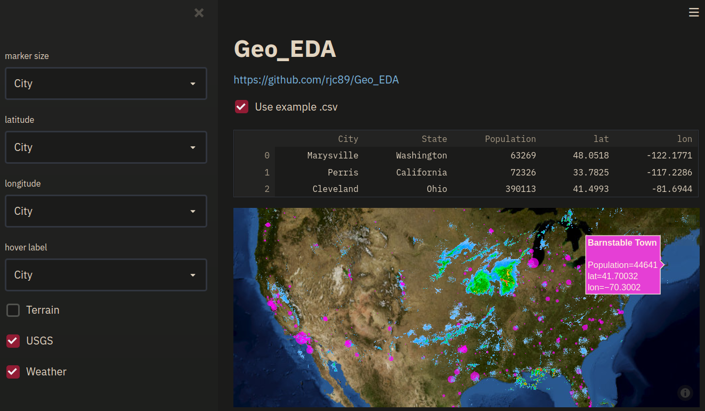

# Geo_EDA

### A tool for geospatial visualisation

### Idea
Create a simple web app enable the visualisation of geospatial datasets from tabulated data containing longitude and latitude columns 

### Usage

Select the longitude and latitude columns from the drop down and customise what is shown and how using the sidebar widgets

### Approach

The map is generated using Plotly express with publically available USGS and weather layers. The web app was built with Streamlit

### Extra complications to add

GeoJSON chloropleth coloring support